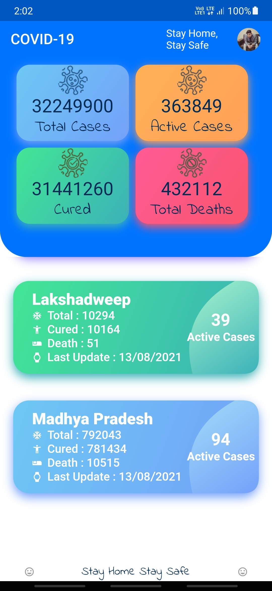
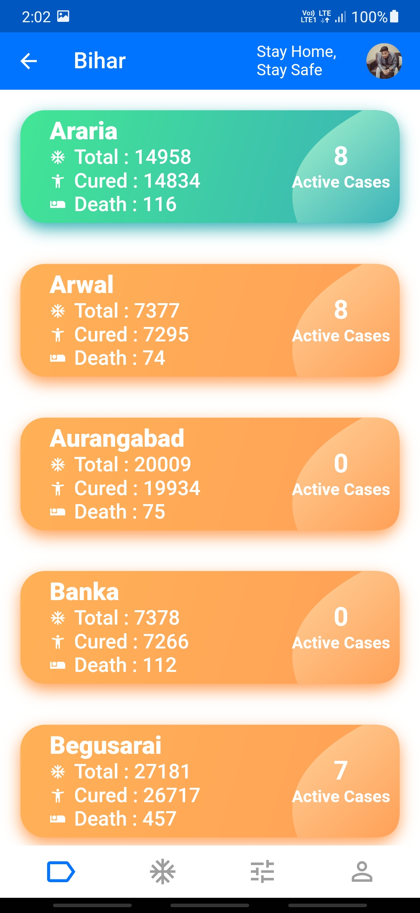

# lockdown

Check the number of corona patients in India and state wise.

mobile application on Flutter to check the number of corona patients in India. check patient state and district wise. build it as a part of flutter learning process.

                                                                      

## Getting Started

there is a lockdown.apk file in the root directory. you can download it and install it.
